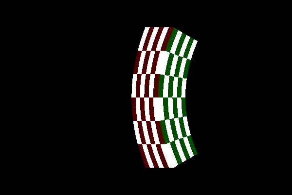

# specRelTrace

## Ray-tracing in special relativity, an OpenGL version

Real-time ray tracing is possible on most GPUs. This requires an openGL library and an app builder, which 
are glumpy and pyopengl in our case. Install all the requirements as

```
python -m pip install numpy pyopengl glumpy 
```

You can run
```
python renderPlanets.py
```
and
```
python renderGallery.py
```
for a nice moving outputs like these

The camera revolves around the sun and its Lorentz boost is always visible, and by default the camera points to jupiter. You can change the camera position with a mouse drag around the sun, or move the revolve center a bit above the sun. 


You can rotate the scene with a mouse drag. The relativistic Doppler effect shifts the light to ultraviolet (UV) or infrared range, with a non-static visual effect.
The camera rotates around and points to a single point, above the stationary cube on the black and white plane. The required Lorentz boost rotates and distorts tthe view, this is the relativistic aberration.

## A fallback renderer in pure python

Simple ray-tracing code written in python. 
The example renderer produces a ray-traced image of a checkered cube, moving with 90% the speed of light.


<!--  -->

Just run 
```
python renderMovingCube.py
```
to generate the above image as a PNG. It takes about a minute. 


## Took some inspiration from:

# general

https://medium.com/swlh/ray-tracing-from-scratch-in-python-41670e6a96f9

https://kivy.org/doc/stable/examples/gen__demo__shadereditor__main__py.html

https://glumpy.readthedocs.io/en/latest/tutorial/easyway.html

# structure, box, noise, hue

https://www.shadertoy.com/view/tl23Rm

https://www.shadertoy.com/view/ll2cDc

https://www.shadertoy.com/view/ltB3zD
